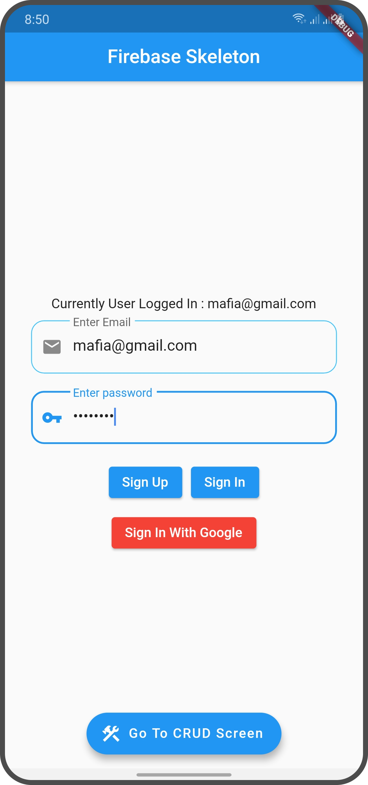
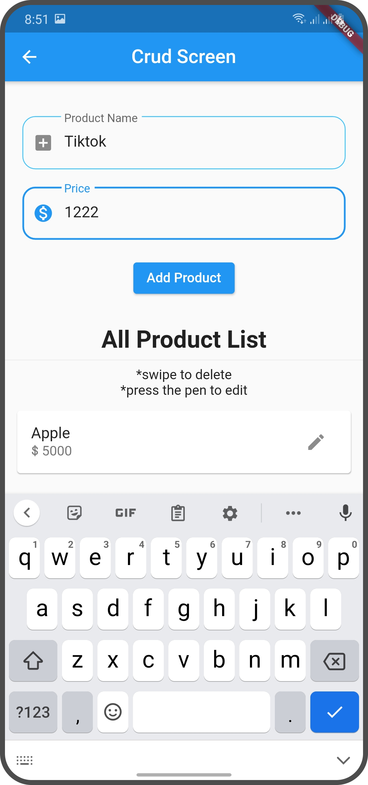
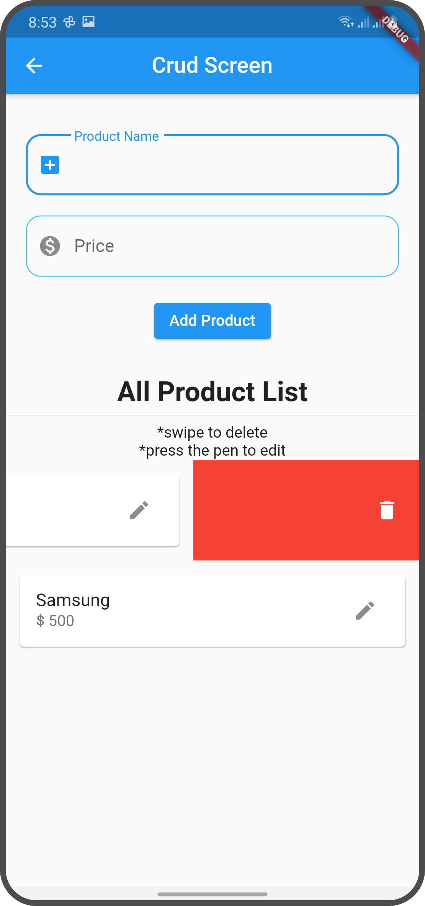
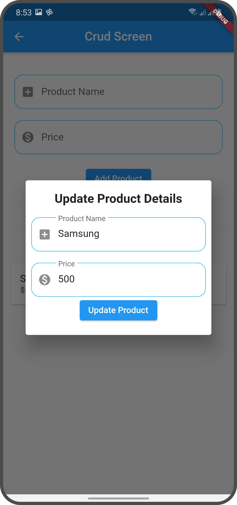

# firebase_skeleton

>Why this project is for?

To make things easier when starting a flutter firebase project.

- Sign in with email and pass
- Sign up with email and pass
- Sign in with google
- CRUD with firestore

## Things you need to do

- Replace the package name with yours
    >com.example.app

- Add Google json file generated by firebase
- And follow the setup process of Flutter Firebase docs if you want to explore more [here](https://firebase.flutter.dev/).

## Screenshots

